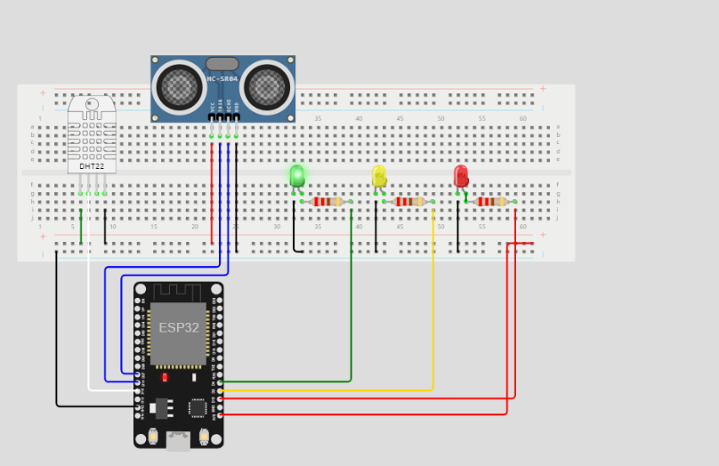
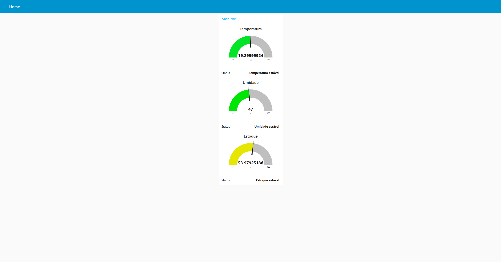
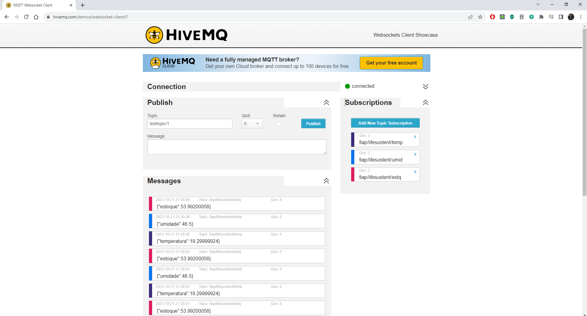
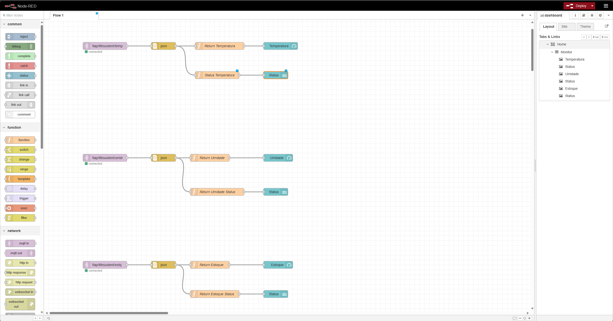

# CHECHPOINT 05 - ESR1

## Alunos

- Deivison Pertel – **RM 550803**
- Eduardo Akira Murata – **RM 98713**
- Guilherme Jacob Soares da Costa – **RM 84581**
- Fabrizio El Ajouri Romano – **RM 550410**
- Wesley Souza de Oliveira – **RM 97874**

# Projeto IoT com Sensores DHT22/11 e HC-SR04
Este é um projeto de Internet das Coisas (IoT) que utiliza os sensores DHT22/11 para medir temperatura e umidade, além do sensor HC-SR04 para medir distâncias, simulando o quanto o estoque do ambiente está cheio ou vazio. O projeto foi desenvolvido no ambiente de simulação do WOKWI e é complementado por um sistema de comunicação MQTT e um dashboard Node-RED para visualização dos dados. 

## O projeto faz uso das seguintes tecnologias e componentes:

### Hardware
- ESP32 DevKit V1
- Sensor de Temperatura e Umidade DHT22/11
- Sensor de Ultrassom HC-SR04
- LEDs (Vermelho, Amarelo e Verde)
- Resistores (220Ω)
- Breadboard

### Hardware
- IDE Arduino
- Bibliotecas ArduinoJson, DHTesp e PubSubClient
- Node-RED (para o dashboard)

## Funcionalidades

O objetivo principal deste projeto é criar um sistema de monitoramento que atende às seguintes funcionalidades:

1. **Monitoramento de Estoque**: Utiliza o sensor de ultrassom HC-SR04 para medir a distância até o estoque. Quando o estoque estiver abaixo de um limite definido, acende um LED vermelho. Se estiver em um nível seguro, acende um LED verde.

2. **Monitoramento de Temperatura e Umidade**: Utiliza o sensor de temperatura e umidade DHT22/11 para monitorar a temperatura ambiente. Se a temperatura ou umidade estiverem fora da faixa desejada, acende um LED amarelo para indicar um problema.

3. **Comunicação MQTT**: Implementa a comunicação MQTT para enviar informações relevantes em tópicos separados. Os dados do estoque são publicados em um tópico MQTT, assim como a temperatura e umidade.

4. **Dashboard Node-RED**: O projeto inclui um dashboard criado no Node-RED, permitindo a visualização gráfica das informações coletadas, como a umidade ambiente.

## Configuração

Para executar este projeto, siga os passos abaixo:

1. **Hardware**: Monte o circuito conforme as conexões indicadas no arquivo `diagram.json`.

2. **IDE Arduino**: Abra o código-fonte do projeto presente no arquivo `sketch.ino` em sua IDE Arduino. Certifique-se de ter as bibliotecas necessárias (ArduinoJson, DHTesp e PubSubClient) instaladas.

3. **Configurações de Rede**: Defina as configurações de rede, incluindo o SSID e a senha no código, conforme necessário.

4. **Configurações MQTT**: Defina as configurações do Broker MQTT, como o endereço e a porta.

5. **Faça o Upload**: Compile e faça o upload do código para o ESP32.

6. **Node-RED**: Importe o código do dashboard Node-RED do arquivo `flows.json`.

7. **Execute o Projeto**: Com o hardware montado, o código carregado no ESP32 e o Node-RED configurado, você pode monitorar o estoque, temperatura e umidade em tempo real.

## Vídeo Explicativo

Para um guia visual e mais detalhes sobre o projeto, assista ao vídeo explicativo disponível no [YouTube](https://youtu.be/t9fzFjkYd9A).

## Circuito

## DashBoard

## MQTT

## NODE-RED

### *Observação*

*Para mais informações, acesse nosso [github](https://github.com/wesley-souza8/EDGE-CP05.git)*
